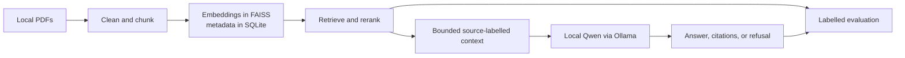

# RAGeval — Local RAG for Embedded Software Documentation

Embedded software work depends on facts scattered across datasheets, technical
reference manuals, errata, SDK documentation, and team knowledge. A language
model may already know common ESP32 facts, but that does not show whether it can
find and use the correct evidence for a specific device, document revision, and
operating condition.

RAGeval is a local-first Retrieval-Augmented Generation prototype and evaluation
harness built around ESP32 documentation. It deliberately uses a small local
generation model so that retrieval quality remains visible: the experiment asks
whether correct context improves answers, citations, and refusal behaviour
without relying on a larger model to compensate for weak retrieval.

RAG can only retrieve knowledge that has been written down. It does not replace
the genuinely unwritten part of tribal knowledge. The longer-term opportunity is
to combine grounded documentation with observable engineering evidence such as
builds, tests, device output, and human review.

## What the prototype does

The current application covers the complete small RAG path:

1. Load local PDF documents from `data/`.
2. Clean and split prose and table-like content into chunks.
3. Create local embeddings with MiniLM, BGE, or Arctic Embed.
4. Store chunk metadata in SQLite and vectors in model-specific FAISS indexes.
5. Retrieve semantic candidates and apply transparent heuristic reranking.
6. Supply bounded, source-labelled excerpts to Qwen 3.5 9B through Ollama.
7. Return a concise answer with `[S1]`-style citations, or say
   `I do not know based on the provided documents.` when the excerpts do not
   establish an answer.

The repository also includes labelled retrieval benchmarks, closed-book versus
oracle-context versus dense-RAG generation evaluation, deterministic scoring,
saved run artifacts, and an interactive evaluation explorer.

## Ask a question on Apple Silicon

This is the shortest path from a fresh clone to one grounded answer on the
current M1 Mac setup.

### 1. Install the native tools

```bash
brew install python@3.12 ollama
brew services start ollama
```

### 2. Add PDFs

Put one or more PDFs in `data/`:

```text
data/
  my-datasheet.pdf
  my-reference-manual.pdf
```

The folder is present in a fresh clone, but PDFs are intentionally ignored by
Git. For ordinary RAG use, these can be any PDFs you want to question. To run
the repository's corpus-specific benchmark, follow the document setup in
[Evaluation](#evaluation-instead-of-a-hand-picked-demo).

### 3. Build the Arctic retrieval index with the Apple GPU

```bash
# ask_question.sh uses Arctic by default.
./local_ingest_data.sh --model arctic
```

On first use, the wrapper creates `.venv`, installs the pinned Python
dependencies, downloads the public embedding model, verifies PyTorch MPS, and
builds the index. This native path lets embedding use the Apple GPU; Docker is
portable but CPU-only on macOS because its Linux VM cannot access Metal. Later
runs reuse unchanged documents and existing artifacts.

### 4. Create the local generation model

```bash
ollama create rageval-qwen -f Modelfile
```

Ollama runs natively and can use Apple Metal for generation.

### 5. Ask something

```bash
./ask_question.sh "What voltage and maximum output current can the ESP32 built-in flash regulator supply?"
```

Inspect exactly what was supplied to the model with:

```bash
./ask_question.sh --show-context "What voltage can the flash regulator supply?"
```

The command prints the answer, cited document pages, retrieval time, prompt and
output tokens, time to first token, and generation speed.

### Defaults and model selection

The model aliases select separate embedding indexes over the same chunks:

| Alias | Model | Why it is included |
| --- | --- | --- |
| `mini` | `sentence-transformers/all-MiniLM-L6-v2` | Small, fast 384-dimensional general baseline |
| `bge` | `BAAI/bge-base-en-v1.5` | Established 768-dimensional retrieval baseline |
| `arctic` | `Snowflake/snowflake-arctic-embed-m-v1.5` | Retrieval-focused 768-dimensional model with a repeatable Apple MPS loading path |

Ingestion defaults to `--model all`, while interactive search defaults to
`mini` and grounded question answering defaults to `arctic`. The selected
search or question model must have a corresponding index:

```bash
# Default ingestion: incrementally update documents and ensure all three indexes.
./local_ingest_data.sh

# Smaller one-model setup: build MiniLM, then explicitly use MiniLM to ask.
./local_ingest_data.sh --model mini
./ask_question.sh --embedding mini "What does the document say about wake-up sources?"

# Show the complete options after the native environment has been created.
./ask_question.sh --help
```

See the [command and parameter reference](docs/local-workflow.md) for every
root wrapper and the [ingestion design](docs/ingestion.md) for model details,
incremental behaviour, and clean rebuilds.

## Docker and portable retrieval

Docker remains the portable retrieval workflow. On this Mac it runs through
Colima and uses CPU-only PyTorch because a Linux container cannot access Metal:

```bash
colima start
docker compose build
./ingest_data.sh --model arctic
./run_script.sh search_index.py --model arctic "maximum output current"
```

Windows and Linux users can use Docker Desktop or another Compose-compatible
runtime and invoke the underlying Compose/Python commands. The native
`local_ingest_data.sh` path is an additional Apple Silicon workflow, not a
replacement for Docker portability.

To build every embedding index, or explicitly replace all generated local
storage:

```bash
# Default: incremental update, all registered embedding indexes.
./ingest_data.sh

# Default: confirmation required. Add --yes only for deliberate automation.
./ingest_data.sh --clean
```

Clean mode asks for confirmation. Generated indexes, databases, model caches,
evaluation runs, and source PDFs remain local and are not committed.

## How it works



FAISS first returns semantic candidates. The current reranker adds a modest
exact-token-overlap score, penalizes contents/revision-history-like chunks, and
deduplicates results from the same paragraph. It is intentionally inspectable;
it is not a learned reranker or a relevance classifier. Every FAISS vector id is
explicitly mapped back to SQLite chunk and source metadata.

The selected top-k excerpts are all supplied to the model, with each excerpt
bounded to 2,400 characters. That makes retrieval depth a measurable quality,
latency, and token-cost trade-off. Learned reranking, relevance gating, dynamic
top-k, and context compression are documented as future comparisons in
[`todo.md`](todo.md).

See [architecture](docs/architecture.md) and the
[retrieval pipeline](docs/retrieval-pipeline.md) for the detailed boundaries and
score definitions.

## How the assignment concerns map to the code

| Concern | Current implementation |
| --- | --- |
| UI | Grounded-answer CLI plus a browser evaluation explorer |
| Config | Model registry, versioned benchmark JSON, pinned dependencies, and an Ollama `Modelfile` |
| Guardrails | Bounded context, source labels, an instruction to treat excerpts as data, a citation contract, and explicit refusal text; no PII redaction layer yet |
| Orchestration | A small explicit retrieve-then-read pipeline with separate retrieval, prompting, provider, and evaluation modules |
| Chunking | Custom sentence-oriented and first-pass table-aware PDF chunking with source metadata |
| Embeddings | Local MiniLM, BGE, and Arctic Embed models behind strict aliases |
| Vector store | Normalized vectors in FAISS and inspectable metadata plus explicit vector mappings in SQLite |
| Generation | A narrow local Ollama provider using Qwen 3.5 9B with low-variance settings |
| Prompting | Source-labelled grounding, citations for factual claims, and refusal when evidence is insufficient |
| Testing | Unit tests for prompts, citations, refusal scoring, benchmark loading, run summaries, and visualization export; labelled retrieval and generation evaluations test behaviour |

The prototype intentionally omits production authentication, tenant isolation,
PII controls, durable job orchestration, managed storage, deployment, and a
public API. Those are design discussion points rather than hidden claims about
the current implementation.

## Incremental implementation sequence

The repository was built as small, reviewable slices rather than as one large
generated application:

1. Establish PDF loading, chunking, SQLite metadata, FAISS, and local search.
2. Make index-to-metadata identity explicit and add inspection tools.
3. Add multiple embedding models and a human-labelled retrieval benchmark.
4. Add wrong-device distractors and visualize retrieval successes and failures.
5. Connect Arctic retrieval to local Qwen with citations and refusal.
6. Compare closed-book, oracle-context, and dense-RAG answers using saved,
   deterministically scored runs.
7. Add token, latency, partial-run, and frozen-demo reporting as evaluation
   exposed new questions.

Each slice kept the underlying pipeline usable and created evidence for the next
architectural decision.

## Evaluation instead of a hand-picked demo

The committed golden dataset requires the exact ESP32 document editions listed
in the [corpus inventory](docs/corpus-inventory.md). Add those PDFs to `data/`
and build the indexes before running the comparison. Other PDFs still work for
ordinary RAG questions, but they will not match the benchmark's document, page,
and text-evidence labels.

Run the committed generation comparison:

```bash
./run_generation_eval.sh
```

It asks the same typed questions under three evidence conditions:

- **Closed book:** Qwen receives no documents.
- **Oracle:** Qwen receives manually verified evidence.
- **Dense RAG:** Qwen receives the Arctic pipeline's top-three results.

The runner saves its resolved manifest, every attempt as JSONL, and an aggregate
summary. Scores keep required facts, refusal intent, exact refusal format,
citations, and retrieval evidence hits separate. Raw answers remain available
because substring checks cannot safely establish that every free-form claim is
supported.

Open the retrieval and generation reports with:

```bash
# First-time Docker setup on the current macOS environment:
colima start
docker compose build

./view_evaluation.sh
```

The evaluation runner itself uses the native `.venv`, MPS retrieval, and local
Ollama model. The explorer command above then uses Docker to regenerate the
report JSON and serve the browser UI. Docker has its own model cache, separate
from the native Hugging Face cache.

For presentation safety, the current dashboard can be frozen and served without
Docker, model loading, Ollama, indexes, source PDFs, or internet access:

```bash
./create_snapshot_from_current_eval.sh
./backup_view_evaluation.sh
```

See [evaluation design](docs/evaluation.md) and the
[generation evaluation specification](docs/generation-evaluation-plan.md).

## Tests

The repository has standard-library unit tests under `tests/`. After the native
environment has been created, run:

```bash
./.venv/bin/python -m unittest discover -s tests -v
```

The current unit tests cover prompt construction, stable source labels,
citation parsing, refusal and fact scoring, benchmark configuration, aggregate
metrics, partial-run recovery, and generation-report export. The labelled
benchmarks provide the behavioural checks for retrieval and generation; broader
ingestion and end-to-end integration tests remain future work.

Validate that the committed retrieval labels still resolve against the exact
local corpus with:

```bash
./.venv/bin/python scripts/validate_benchmark.py
```

## AI-native development workflow

Most implementation and documentation in this repository was generated with AI
coding agents. The project was AI-native from its beginning, but not
decision-free or review-free.

Every proposed change was manually reviewed through Git before it was accepted.

The human role retained ownership of the problem, scope, architecture,
trade-offs, guardrails, and acceptance decisions. Development usually followed
an **ask first, implement second** loop:

1. Discuss the next capability and the architectural questions with an agent.
2. Choose the direction and record repository-level boundaries in `AGENTS.md`,
   detailed design notes, or `todo.md`.
3. Let the agent implement a small, scoped change and its validation.
4. Inspect the diff and observable results through version control.
5. Refine the benchmark, documentation, or next task using what was learned.

This produced incremental commits rather than one large generated application.
Scope changed as evidence accumulated—for example, benchmark questions were
tightened after evaluation exposed ambiguity, and Jina was replaced only after
its custom model code proved incompatible with native macOS MPS despite working
on CPU. These were reviewed engineering decisions made from observed results.

The repository itself is part of the agent harness: `AGENTS.md` supplies stable
working rules, `todo.md` supplies current intent, focused docs explain the
architecture, tests and benchmarks give the agent observable feedback, and Git
keeps every proposed change reviewable. This project therefore demonstrates
both a RAG prototype and a structured way of developing software with agents.

## Where it could go next

The current CLI is a deliberate stopping point for the small prototype. Useful
next experiments include better reranking and context selection, more controlled
model/chunker comparisons, a REST API and conversation UI with explicit memory
rules, and a bounded agentic loop that can decide when to retrieve and when to
refuse. Turning that into a production feature would additionally require
security, privacy, tenant isolation, durable ingestion, observability, scaling,
and CI evaluation gates.

The prioritized questions and trade-offs are maintained in [`todo.md`](todo.md),
not as claimed features in this overview.

## Documentation

- [Documentation index](docs/README.md)
- [Architecture and module boundaries](docs/architecture.md)
- [Local workflows](docs/local-workflow.md)
- [Ingestion and incremental updates](docs/ingestion.md)
- [Retrieval and reranking](docs/retrieval-pipeline.md)
- [Evaluation design](docs/evaluation.md)
- [Local Qwen and Ollama workflow](docs/local-model.md)
- [Generation evaluation specification](docs/generation-evaluation-plan.md)
- [Evaluation explorer](docs/visualization.md)
- [Corpus inventory](docs/corpus-inventory.md)
- [Possible longer-term directions](docs/roadmap.md)
- [Current state, limitations, and next work](todo.md)

`todo.md` is the single living status and priority list. Other documentation
describes the current design or possible directions without maintaining a
second task list.
