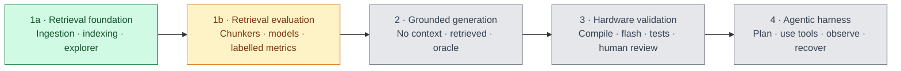
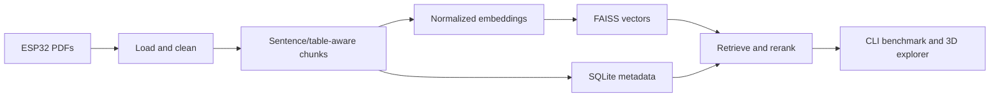

# RAGeval — Context Engineering for Embedded Software

Embedded development depends on information scattered across datasheets,
reference manuals, SDK documentation, board behaviour, and team knowledge.
Giving an AI coding agent access to those documents is easy; showing that it
retrieves the right evidence and produces better engineering work is harder.

RAGeval is a local-first experimental harness for measuring that difference.
The current ESP32 corpus is used to study chunking, embeddings, retrieval, and
evaluation before adding code generation and agentic workflows.

The long-term question is whether an inspectable agent can make better embedded
software changes when its harness supplies grounded context and checks results
against software and hardware evidence.

> **Current phase:** retrieval foundations and evaluation. PDF ingestion,
> incremental FAISS indexing, SQLite metadata, local search, reranking, batch
> queries, and a 3D embedding explorer are implemented. The labelled multi-model
> and multi-chunker evaluation matrix is next.

## Project path



- **Phase 1 — Context and retrieval:** compare chunking strategies, embedding
  models, literal search, and dense retrieval against human-labelled evidence.
- **Phase 2 — Grounded generation:** compare local and hosted coding models with
  no context, retrieved context, and known-good oracle context.
- **Phase 3 — Hardware validation:** evaluate outputs with deterministic checks
  such as compilation and tests, then hardware behaviour and human review where
  automation cannot establish correctness.
- **Phase 4 — Agentic harness:** add planning, tools, memory, observation, and
  recovery only after the underlying retrieval and generation stages are
  measurable.

Green means implemented, amber means current work, and grey means planned. The
roadmap is an experimental sequence, not a claim that the later stages exist.

## Current architecture



The retrieval unit and display context are deliberately separate, and every
FAISS vector id is mapped explicitly back to SQLite metadata. See
[architecture](docs/architecture.md) and the current
[retrieval pipeline](docs/retrieval-pipeline.md).

## Run locally

Requires Docker. On macOS this project uses Colima.

```bash
colima start
docker compose build
./ingest_data.sh
./view_evaluation.sh
```

Useful commands:

```bash
# Incrementally process only changed source PDFs
./ingest_data.sh

# Confirm, clear generated storage, and rebuild
./ingest_data.sh --clean

# Run an individual Python tool in the container
./run_script.sh search_index.py "maximum current"
./run_script.sh benchmark_search.py --top-k 3
./run_script.sh db_inspect.py stats

# Regenerate and open the explorer on another port
./view_evaluation.sh 8080
```

Source PDFs belong in `data/`. Generated indexes, databases, model downloads,
and visualization data remain local and are not committed.

## Documentation

- [Documentation index](docs/README.md)
- [Architecture and boundaries](docs/architecture.md)
- [Local workflow and commands](docs/local-workflow.md)
- [Ingestion and incremental updates](docs/ingestion.md)
- [Retrieval pipeline](docs/retrieval-pipeline.md)
- [Evaluation design](docs/evaluation.md)
- [Embedding explorer](docs/visualization.md)
- [Project roadmap](docs/roadmap.md)
- [Detailed retrieval-evaluation plan](docs/retrieval-evaluation-plan.md)

The immediate implementation checkpoint is kept in [NEXT_STEPS.md](NEXT_STEPS.md),
and the working engineering list is in [todo.md](todo.md).
