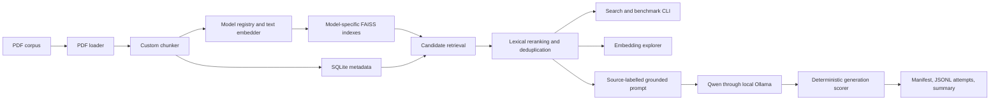

# Architecture

## Purpose

RAGeval is an experimentation platform for measuring how domain context affects
AI-assisted embedded engineering. It favours explicit data flow and inspectable
artifacts over framework abstraction.

The current implementation evaluates retrieval, exposes one grounded-answer
CLI using Arctic retrieval and local Qwen generation, and runs a repeatable
three-condition generation benchmark. Agentic execution remains a later stage.

## Current data flow



## Current boundaries

- `scripts/ingest.py` orchestrates discovery, change detection, chunking,
  embedding, metadata updates, and FAISS updates.
- `scripts/chunkers/` owns chunking behaviour.
- `scripts/processing/` owns PDF loading and embedding.
- `scripts/utils/db.py` owns SQLite schema and queries.
- `scripts/search_index.py` owns retrieval and result reranking.
- `scripts/generation/` owns the Ollama transport and grounded prompt format.
- `scripts/answer_question.py` composes retrieval with generation;
  `ask_question.sh` exposes the supported native macOS command.
- `scripts/evaluation/` owns generation benchmark loading, evidence conditions,
  deterministic scoring, artifact persistence, and aggregation;
  `run_generation_eval.sh` exposes the canonical local run.
- `scripts/visualization/` exports browser-ready visualization data.
- `scripts/visualization/generate_generation_evaluation.py` converts complete
  or partial JSONL generation runs into the shared evaluation page without
  modifying historical run artifacts.
- root shell scripts provide task-oriented Docker workflows.

Project-level resources remain at the root:

- `data/` contains local source documents.
- `storage/` contains generated SQLite and FAISS artifacts.
- `visualization/` contains the browser page and generated local data.
- `runs/` contains ignored, reproducible generation-evaluation artifacts.
- `compose.yaml`, `Dockerfile`, and `requirements.txt` define the runtime.

## Important invariants

- Search ranks `chunk_text`; `paragraph_text` is display or downstream context.
- FAISS identity is resolved through the explicit
  `(index_id, vector_id) -> chunk_id -> metadata` mapping.
- Every model comparison uses the same stored chunk identities.
- Normal ingestion is incremental; destructive rebuilding is explicit.
- Retrieval metrics and generated-answer metrics remain separate.
- Framework comparisons must not silently change several experimental variables
  at once.

## Experiment architecture

The model registry and multi-index layer implement the first configurable
dimension. Chunkers and retrieval methods remain planned:

```text
documents
  -> chunker configuration
  -> chunk set
  -> embedding configuration
  -> index
  -> retrieval method
  -> benchmark run
  -> saved metrics and explorer data
```

See the [retrieval evaluation plan](retrieval-evaluation-plan.md) for the
remaining configuration identities and comparison matrix.
